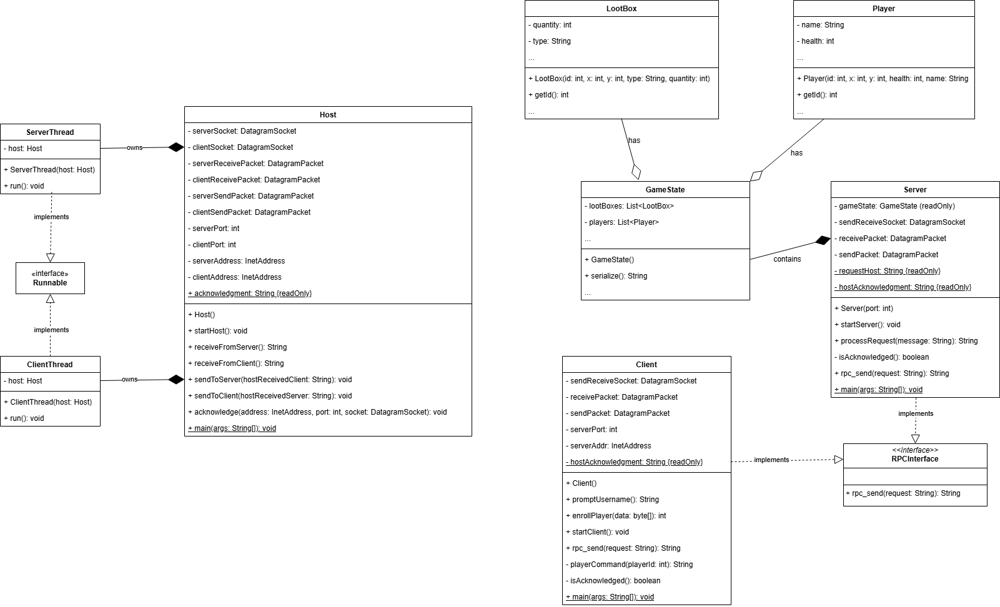
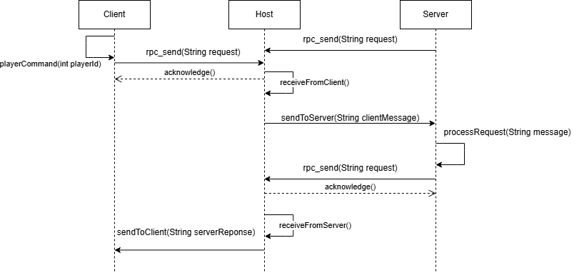

# Battle Royale UDP System

## Table of Contents
1. [Overview](#overview)
2. [Structure](#structure)
3. [Setup Guide](#setup-guide)
4. [Documentation](#documentation)
   1. [UML class diagram](#uml-class-diagram)
   2. [UML sequence diagram](#uml-sequence-diagram)
5. [Questions](#assignment-questions)
6. [Contact Information](#contact-information)

## Overview
A three-part Remote Procedure Call (RPC) system was implemented consisting of:
1. A Client application
2. An Intermediate Host (sometimes called a “router” or “relay”)
3. A Server application

The **Client** sends gameplay requests (e.g., move, pick up loot, attack) to the **Intermediate Host**,
which forwards them on to the **Server**. The **Server** processes each request (e.g., updating positions,
health, or loot availability) and sends its responses back through the **Intermediate Host**, which then
relays them to the **Client**. From the **Client**’s perspective, the Host appears to be the **Server**, and from
the Server’s perspective, the Host appears to be the **Client**. The Host manages two separate threads, **ClientThread**
and **ServerThread**. **ClientThread** handles communication between the Client and the Host while **ServerThread**
handles communication between the Server and the Host, maintaining a two-way channel from the client to the server
using the host.

## Structure

### Client.java
- Represents the client, handles user input and sends gameplay requests to the `Host`. To which the requests
  are processed by the `Server` and returned.
- Uses `DatagramSocket` to communicate with the `Host`
- Waits for an acknowledgment from the `Host` before receiving a response
- Gameplay loop continues until user enters `QUIT`
### Host.java
- Represents the intermediate host, acts as a relay between `Client` and `Server`, forwarding `DatagramPackets`
  between them without modification
- Manages two threads:
  - `ClientThread` handles communication between Client and Host
  - `ServerThread` handles communication between Server and Host
- Uses two `DatagramSockets` for receiving data and sending data for/to `Client` and `Server` respectively
- Sends acknowledgment messages to the `Client` upon receiving a request
### Server.java
- Represents the server, maintains the game state and processes requests from the `Client`, and sends to
  the result to `Host` to be delivered to the `Client`
- Listens for requests from `Host` using UDP `DatagramSocket` and requests for data when ready
### ClientThread.java
- A thread inside `Host` that listens for requests from the `Client`
- Forwards received messages to the `Server` unless they are acknowledgments
### ServerThread.java
- A thread inside `Host` that listens for responses from the `Server`
- When the `Server` requests data, it waits for the `Client`'s request and forwards it to `Server`
### RPCInterface.java
- Defines the `rpc_send` method for handling the Remote Procedure Call (RPC) communication for `Client` and `Server`
- Implemented by both `Client` and `Server` to simplify sending and receiving messages

### GameState.java
- Represents the game itself, contains 3 classes within, `GameState`, `Lootbox` and `Player`

## Setup Guide
1. Clone or download the project to your computer
2. Open the project in your preferred IDE (Intellij preferred)
3. Compile the project using your IDE, build the project
4. Verify that you have a valid internet connection, as classes will not be able to communicate
5. Execute the main functions of each of the following classes below. The order of execution does not
   change anything, but ensure all 3 are started and running prior to writing into client
   1. `Client`
   2. `Server`
   3. `Host`
6. Ensure that all 3 classes are started in separate terminals, if your IDE overwrites your processes and only
   one class can run at a time, you must manually run them via the terminal, using this guide:
   1. Ensure you are in the correct directory hosting `Host`, `Client` and `Server`
   2. Compile all java files using:
    ```
    javac *.java
    ```
   3. Create 3 terminal instances, while still in the correct directory, start each java file in its own terminal
   ```
   java Client
   ```
   ```
   java Server
   ```
   ```
   java Host
   ```


## Expected Output
Once all 3 java files are up and running, with a valid internet connection active, all interaction will be done within
the `Client terminal`. Insert a player name, then you will be greeted with a list of commands.
If an input guide is needed, you can find one [here](docs/test_inputs.txt) that will guide you through valid inputs.

## Documentation
Below you can find a UML sequence diagram and a UML class diagram of the system
### UML class diagram

### UML sequence diagram


## Assignment Questions
1. Why did I suggest that you use more than one thread for the implementation of the Intermediate
   task?

The implementation of more than one thread for the Host was necessary as there were deadlocks between Client 
and Server when only one Host was being used, otherwise a single threaded approach. The server and the client would 
attempt message the host at the same time. A use case I ran into is at the beginning the program, client will attempt 
to send a request using the player's name for enrollment, and at the same time, the server would poll the host for data. 
The host is supposed to send an acknowledgement once it receives a request from client then forward to server, but it would 
end up sending the acknowledgement to server. Client would then be stuck waiting for an acknowledgement while server passed 
a `NOT_A_COMMAND` flag and wait for another request, leading to a deadlock between them. Therefore, two threads were needed 
to have two-way communication, with one thread handling communication from the client to the server and the other thread 
handling communication from the server to the client. The separation of the two threads allows for independent communication 
between the client and the server through the host without any issues or worries of blocking and deadlocks.

2. Is it necessary to use synchronized in the intermediate task? Explain.

Synchronization was not necessary in Host as there was no shared state between ClientThread and ServerThread. The two threads were independent and do not interact
or depend on some shared method or critical section. ClientThread always listens for a client request and forwards them to the Server. 
Likewise, ServerThread always listens for a server request and forwards them to the Client. Because of this request-response structure,
there is no risk of race conditions.

## Contact Information
Mahad Ahmed
101220427
